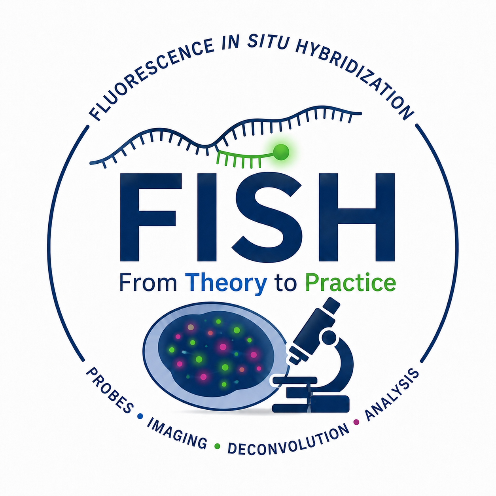

  

<h1 align="center">
  Fluorescence In Situ Hybridization Methods: 
  From Theory to Practice
</h1>

  <b>May 19–21</b> • Mezzanine & Lab IN.1P01.040

---

## Course Overview

This course provides a foundational understanding of **Fluorescence In Situ Hybridization (FISH)**, with a focus on **single molecule RNA FISH (smFISH)**.

Participants will explore the core principles behind FISH alongside practical applications including:

- Probe design
- Fluorescent oligo hybridization
- Widefield fluorescence imaging
- Image processing and deconvolution
- Quantitative image analysis

The course combines **theory lectures** with extensive **hands-on laboratory sessions**.

Participants will also gain practical experience using:

- [FIJI (ImageJ)](https://imagej.net/software/fiji/)
- [Deconwolf](https://deconwolf.fht.org/)

---

## Course Information

| Item | Details |
|---|---|
| **Location** | Mezzanine and Lab IN.1P01.040 |
| **Format** | Theory lectures + hands-on laboratory sessions |
| **Topics Covered** | FISH principles, probe design, hybridization, fluorescence imaging, deconvolution, image analysis |

---

# Schedule

### Day 1 — Tuesday, May 19

| Time | Activity | Trainer(s) |
|---|---|---|
| 11:00–12:00 | Theory Introduction | Magda Bienko |
| 12:00–13:00 | Probe Design Theory | Giulia Peveri, Erik Wernersson |
| 13:00–14:00 | Lunch Break | — |
| 14:00–15:00 | **Hands-on:** Probe Design | Giulia Peveri, Erik Wernersson |
| 15:00–15:30 | Probe Production | Nicola Crosetto |
| 15:30–17:30 | **Lab 1:** Probe Hybridization | Giulia Della Chiara |

---

### Day 2 — Wednesday, May 20

| Time | Activity | Trainer(s) |
|---|---|---|
| 09:30–10:45 | **Lab 2.1:** Washes & Fluorescent Oligo Hybridization | Giulia Della Chiara |
| 10:45–11:00 | Coffee Break ☕ | — |
| 11:00–13:00 | **Lab 2.2:** Washes & Mounting | Giulia Della Chiara |
| 13:00–14:00 | Lunch Break | — |
| 14:00–15:15 | <nobr>Introduction to Image Processing & Deconvolution</nobr> | Erik Wernersson, Giulia Della Chiara |
| 15:15–15:30 | Coffee Break ☕ | — |
| 15:30–17:00 | **Hands-on:** Deconvolution & FIJI | Erik Wernersson, Giulia Peveri, Giulia Della Chiara |

### Day 3 — Thursday, May 21

| Time | Activity | Trainer(s) |
|---|---|---|
| 09:30–10:30 | Theory Imaging: Cell Segmentation & Dot Detection | Erik Wernersson |
| 10:30–11:30 | **Lab 3:** Imaging — Group 1 | Giulia Della Chiara |
| 11:30–12:30 | **Lab 3:** Imaging — Group 2 | Giulia Della Chiara |
| 12:30–14:00 | Lunch Break | — |
| 14:00–15:00 | **Lab 3:** Imaging — Group 3 | Giulia Della Chiara |
| 15:00–16:00 | **Hands-on:** Image Analysis | Erik Wernersson, Giulia Peveri, Giulia Della Chiara |
| 16:00–17:00 | Closing Remarks & Q&A | Magda Bienko, Nicola Crosetto |

---

# Learning Outcomes

By the end of the course, participants will be able to:

- Understand the theoretical foundations of FISH and smFISH
- Design and produce fluorescent probes
- Perform hybridization and washing procedures
- Acquire fluorescence microscopy images
- Apply deconvolution techniques to microscopy data
- Analyze FISH signals using FIJI and related image processing workflows

---
